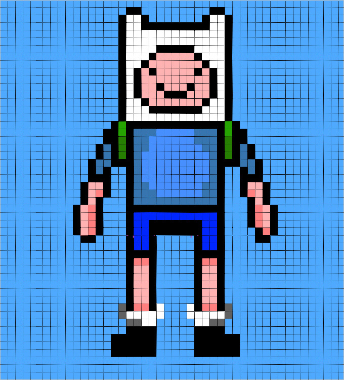

# AdaIN-style - Live demo

This repository is a fork of [AdaIN-style](https://github.com/xunhuang1995/AdaIN-style), with an added file `adain-stream.lua` that allows to perform real-time style transfer with a CPU/GPU from a webcam or an Internet video stream.  

This work is the result of a digital art jam organised by [Labokube - Brussels - Belgium](https://www.facebook.com/labokube/), which took place from 08/04/2017 to 16/04/2017, and was presented live in the Labokube on 16/04/2017 during the [Belkium #2 event](https://www.facebook.com/events/221614868319187/). The resulting twelve-hour stream was on the whole impressive, yielding in most cases accurate real-time transfers of style images.

## Live stream

The video below gives an overview of the application. The style image is displayed in the top left corner. In this video appear the following three styles :

<p align='center'>
  
  
  
</p>

<p align='center'>
<a href="https://www.youtube.com/edit?o=U&video_id=NurRlyOa_A8" target="_blank"></a>
<br>
(Click on image above to get to the video)
</p>

Overall, transfers worked quite nicely for complex textures and styles, see below a few examples.

<p align='center'>

</p>

<p align='center'>


</p>

<p align='center'>


</p>

<p align='center'>


</p>

<p align='center'>


</p>

<p align='center'>


</p>

However, we observed that for 'simple' or 'photorealistic' styles, the transfers worked less well. The  color scheme is somewhat retained (but with noticeable changes, as violet colours using the Southpark style), and blurry surfaces emerge, for example:

<p align='center'>


</p>

<p align='center'>


</p>

The results are still nice to look at :)

## Live streaming details

The set-up consisted of an Android phone running the [IP camera](https://play.google.com/store/apps/details?id=com.shenyaocn.android.WebCam&hl=en) application, allowing to stream the phone video camera on the local network. The video stream was processed on a GPU workstation (using one GTX 1080 GPU card). The program was able to process on average 7 frames/second on a 640\*480 video stream, which was enough for a feeling of live-straming (see the above video). The stylised stream was projected back in the event room, and the mobile phone allowed to move through the room, and have real-time style transfer of the event.

Style images changed randomly every 20 seconds, from a local folder of style images. The folder was updated during the event, with style images provided by participants. Whenever a new file was uploaded in the style folder, the new style was used for one minute.

## Code updates

We focused on:

* Receiving a stream from a smartphone camera
* Processing images on GPU or CPU
* Allowing users to dynamically change the style by uploading new style images in real-time.

Therefore, we simplified the original code in https://github.com/xunhuang1995/AdaIN-style/blob/master/test.lua so that the only two available options are

* whether a CPU or GPU is used for processing the input video stream
* whether the video stream comes from the webcam or an IP video stream. For IP video stream, the IP address of the video stream is hardcoded (here http://192.168.1.20:8080/video, line 47).

We modified the application to handle IP video streams, and added interactive updates of styles: the program automatically changes the style every 20s, or whenever a new style has been loaded in the style folder (used in this case for one minute).

## Run

The code is in `adain-stream.lua`. It requires to install

* Torch and unsup package (see https://github.com/xunhuang1995/AdaIN-style)

* The video_decoder package for getting an IP video stream, see instructions at https://github.com/e-lab/torch-toolbox/tree/master/Video-decoder

For running on a CPU, using the webcam:
```
qlua adain-stream.lua -gpu -1 -video webcam
```

On a MAC OS X 2,9 GHz Intel Core i5, throughput is about one frame per second with a resolution 213\*180 (640\*480 scaled by 1/3).

For running on a GPU, using an IP stream:
```
qlua adain-stream.lua -gpu 0 -video ip
```

With a GTX 1080, throughput is about 7 frames per second with a resolution 640*480.

## Research directions

* Other Networks
* Photorealistic corrections
* Real-time modifications of 'style statistics'

## Resources

* https://github.com/xunhuang1995/AdaIN-style
* https://github.com/jcjohnson/fast-neural-style
* https://github.com/e-lab/torch-toolbox/blob/master/Video-decoder/test-frame.lua

## Authors

* [Yann-Aël Le Borgne](https://yannael.github.io) - Researcher @ [Machine Learning Group](mlg.ulb.ac.be) - Université Libre de Bruxelles - Belgium
* [Pierre-henri Wibaut]() - Developer @ [Labokube](labokube.xyz) - Brussels - Belgium
